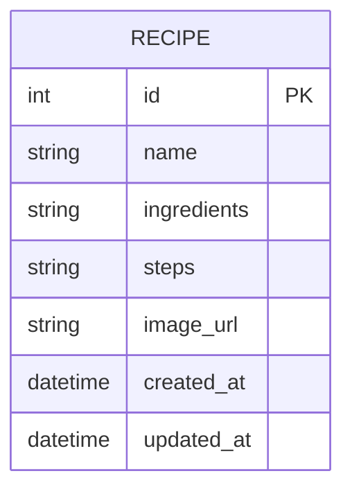

# 資料庫設計文件 (DB_DESIGN)

根據 PRD 的需求，採用極致輕量的設計。為滿足「單人使用」這項條件，將所有食譜資訊（名稱、食材、步驟）儲存在一個 `recipe` 表中，利用 `TEXT` 大量文字欄位儲存食材與步驟，並且後續實作「依照食材推薦」時，可以使用資料庫的字串模糊比對（如 `LIKE`）。

## 1. ER 圖（實體關係圖）

> **說明：**
> 目前 MVP 階段為求簡單，沒有獨立拉出 `INGREDIENT`（食材）表，將食材統一存為文字（例如：「雞肉, 洋蔥, 醬油」），以便快速開發與搜尋。

## 2. 資料表詳細說明

### `recipe` 表

用於儲存食譜的基本資訊內容。

| 欄位名稱 | 型別 | 必填 | 預設值 | 說明 |
| :--- | :--- | :--- | :--- | :--- |
| `id` | INTEGER | 是 | (Auto Increment) | Primary Key（主鍵），唯一識別碼 |
| `name` | TEXT | 是 | 無 | 食譜名稱 |
| `ingredients` | TEXT | 是 | 無 | 食材清單（為求輕量化與快查，可以直接存文字） |
| `steps` | TEXT | 是 | 無 | 製作步驟 |
| `image_url` | TEXT | 否 | NULL | 供後續擴充：食譜圖片的位置或網址 |
| `created_at` | DATETIME | 是 | CURRENT_TIMESTAMP | 建立時間 |
| `updated_at` | DATETIME | 是 | CURRENT_TIMESTAMP | 最後修改時間 |

## 3. SQL 建表語法

對應的建表語法已經存放在：`database/schema.sql`

## 4. Python Model 程式碼

對應的 Model 操作已經存放在：`app/models/recipe.py`
由於秉持輕量化與高效，我們直接使用 Python 內建的 `sqlite3` 實作相關的 CRUD 方法。
