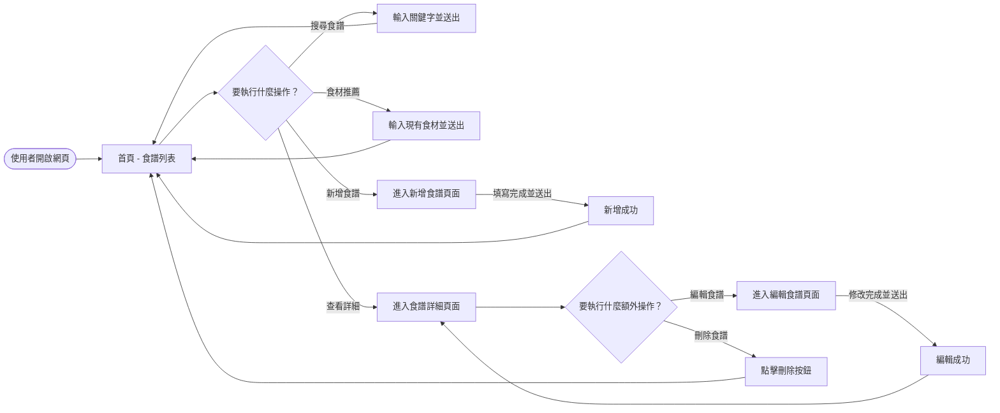
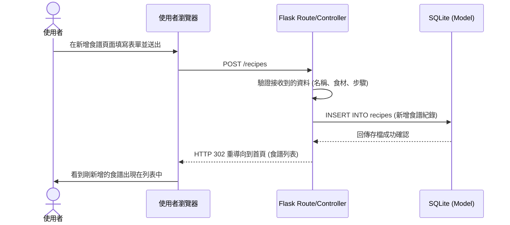

# 流程圖文件 (FLOWCHART)

根據產品需求文件 (PRD) 所描述的需求，以下是系統的使用者流程圖、系統序列圖，以及功能清單對照表。

> **注意：** 系統目前似乎尚未建立 `docs/ARCHITECTURE.md`，但我已根據 PRD 記載的技術限制（Flask + Jinja2 + SQLite）來繪製系統序列圖與推斷架構。

## 1. 使用者流程圖（User Flow）

描述使用者進入食譜收藏系統後的各種操作路徑。

## 2. 系統序列圖（Sequence Diagram）

以下以**「新增食譜」**為例，描述從使用者操作到資料存入資料庫的完整流程。

## 3. 功能清單對照表

列出每個主要功能對應的 URL 路徑與 HTTP 方法。

| 功能 | URL 路徑 | HTTP 方法 | 說明 |
| :--- | :--- | :--- | :--- |
| **首頁 (食譜列表)** | `/` 或 `/recipes` | GET | 顯示所有已收藏的食譜列表 |
| **搜尋食譜** | `/recipes/search` | GET | 透過 Query Parameter（如 `?q=關鍵字`）搜尋食譜名稱 |
| **依照食材推薦** | `/recipes/recommend` | GET | 輸入手上食材，系統推薦符合的食譜 |
| **新增食譜 (表單)** | `/recipes/new` | GET | 顯示填寫食譜內容的 HTML 表單 |
| **新增食譜 (送出)** | `/recipes` | POST | 接收表單資料並儲存至資料庫 |
| **食譜詳細頁面** | `/recipes/<id>` | GET | 顯示特定食譜的完整資訊（食材、步驟等） |
| **編輯食譜 (表單)** | `/recipes/<id>/edit` | GET | 顯示帶有原有資料的表單，供使用者修改 |
| **編輯食譜 (送出)** | `/recipes/<id>/edit` | POST | 接收修改後的表單資料並更新至資料庫 |
| **刪除食譜** | `/recipes/<id>/delete` | POST | 刪除特定的食譜（使用 POST 避免 GET 造成的誤刪風險）|
